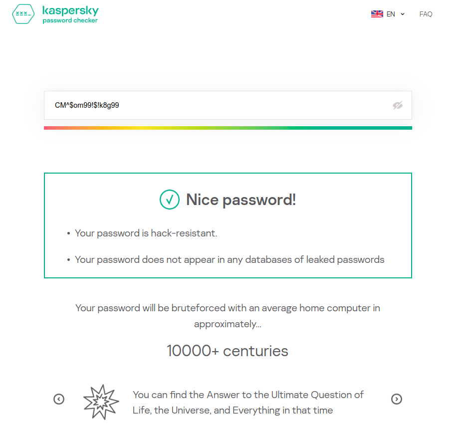

# Password Generator

This C++ project provides offers a powerful, versatile and customizable password generator that creates strong and random passwords for me and you.

## Unique Algorithm

The password generation algorithm is meticulously crafted to guarantee both strength and randomness in the generated passwords.

### Algorithm Overview:

1. **Initialize Character Sets:**
   - Define arrays `alphabets`, `nums`, and `symbols` representing lowercase letters, numbers, and symbols, respectively.

2. **Determine Parts of Password:**
   - Calculate three parts (`prt1`, `prt2`, `prt3`) based on the desired password length (`n`). These parts represent the distribution of characters in the password.

3. **Random Seed and Engine:**
   - Initialize a random seed using `random_device` and a Mersenne Twister engine (`mt19937`).

4. **Generate Lowercase Letters:**
   - For the first part (`prt3`), randomly select lowercase letters from the `alphabets` array.
   - If within the first third of this part, convert the letter to uppercase for added variety.

5. **Generate Numbers:**
   - For the second part (`prt2`), randomly select numbers from the `nums` array.

6. **Generate Symbols:**
   - For the third part (`prt1`), randomly select symbols from the `symbols` array.

7. **Shuffle Characters:**
   - Use `shuffle` to rearrange the characters in the password, providing additional randomness.

8. **Return Generated Password:**
   - The generated password is returned, ready to be displayed or copied.

This meticulous approach ensures a balanced mix of lowercase letters, numbers, and symbols, with shuffling adding an extra layer of unpredictability, resulting in strong and unique passwords.

## Tested Password on kaspersky.com:

- **Length 8:** Despite being a relatively short password, it was not found in any databases.

    <kbd>
    
    </kbd>

- **Length 12:**

    <kbd>
    
    </kbd>

- **Length 16:**

    <kbd>
    
    </kbd>

## Usage

### generator.cpp

The `generator.cpp` file contains the C++ code for the password generator. It utilizes a unique algorithm along with the Mersenne Twister random number engine, providing options for generating passwords with a mix of uppercase letters, lowercase letters, numbers, and symbols.

#### How to Run:

1. Compile the C++ code:

    ```bash
    g++ generator.cpp -o generator
    ```

2. Run the compiled executable:

    ```bash
    ./generator
    ```

3. Enter the desired length for the password when prompted. A length of 12 or more is recommended for strong passwords.

4. The generated password will be displayed, and you can copy and paste it as needed.

### run.sh - a simpler way to run the code

The `run.sh` Bash script simplifies the compilation and execution process for the C++ program. This is only for Linux.

#### How to Run:

1. Make the script executable:

    ```bash
    chmod +x run.sh
    ```

2. Run the script:

    ```bash
    ./run.sh
    ```

The script compiles `generator.cpp` using `g++` and then executes the generated `generator` executable.

## Save Passwords

The `savePassword.h` header file adds a new feature to save generated passwords with user-defined keys for easy identification.

### How to Use:

1. When prompted, choose to save the password in a `passwords.txt` file.

2. Enter a tag to identify your password.

3. Your password, along with the provided tag, will be saved in the `passwords.txt` file.

## Notes

- The password generation algorithm is a unique creation designed for strong and random passwords.
- The C++ code uses the Mersenne Twister random number engine for better randomness.
- Ensure you have a C++ compiler installed on your system before running the code.

Feel free to customize the code further or integrate additional features based on your requirements.

