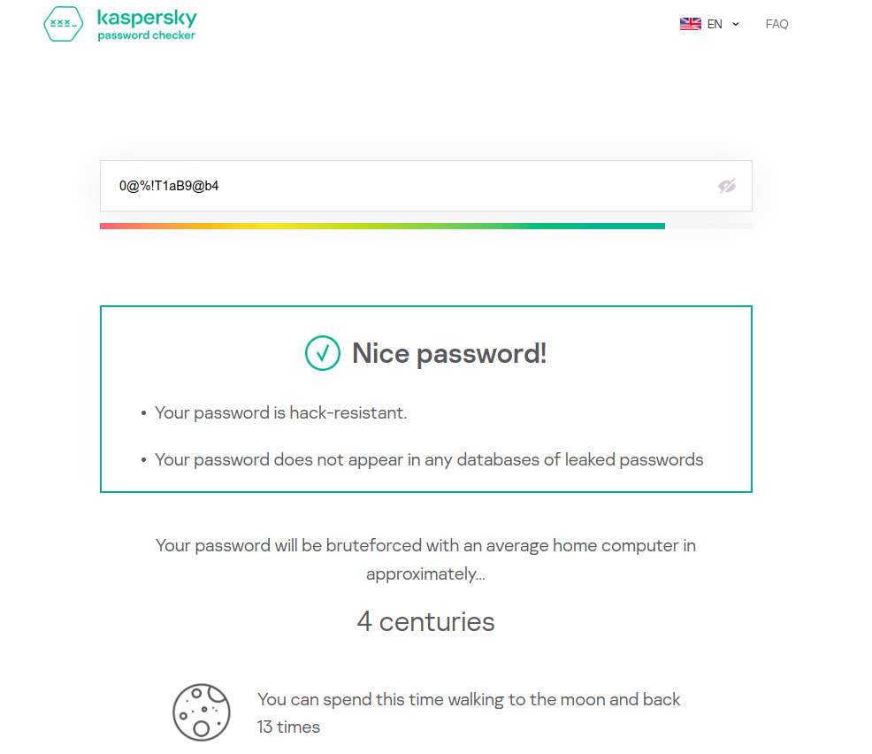

# RaNdDoom

## Introduction

This C++ project offers a powerful, versatile and customizable password generator that creates strong and random passwords for me and you. The project now includes additional features such as password encryption and decryption, so that now even if someone open your passwords.txt file it will not be a problem as passwords will be encrypted and thus they make no sense this provides a comprehensive solution for managing secure passwords.

## Tested Password on kaspersky.com:

- **Length 8:** Despite being a relatively short password, it was not found in any databases.

    <kbd>
    
    </kbd>

- **Length 12:**

    <kbd>
    
    </kbd>

- **Length 16:**

    <kbd>
    
    </kbd>

## Project Modules

### 1. generator.h

The `generator.h` module is responsible for generating strong and random passwords. The algorithm ensures a balanced mix of lowercase letters, numbers, and symbols. The password length is customizable, with a recommended length of 12 or more for stronger passwords.

### Algorithm Overview:

1. **Initialization of Character Sets:**
   - Define arrays `alphabets`, `nums`, and `symbols` representing lowercase letters, numbers, and symbols, respectively.

2. **Determine Parts of Password:**
   - Calculate three parts (`prt1`, `prt2`, `prt3`) based on the desired password length (`n`). These parts represent the distribution of characters in the password.

3. **Random Seed and Engine:**
   - Call makeRadom() from random.h function to generate random numbers by initializing a random seed using `random_device` and a Mersenne Twister engine (`mt19937`).

4. **Generate Lowercase Letters:**
   - For the first part (`prt3`), randomly select lowercase letters from the `alphabets` array.
   - If within the first third of this part, convert the letter to uppercase for added variety.

5. **Generate Numbers:**
   - For the second part (`prt2`), randomly select numbers from the `nums` array.

6. **Generate Symbols:**
   - For the third part (`prt1`), randomly select symbols from the `symbols` array.

7. **Shuffle Characters:**
   - Use `shuffle` to rearrange the characters in the password, providing additional randomness.

8. **Return Generated Password:**
   - The generated password is returned, ready to be displayed or copied.


#### How to Use:

1. Enter the desired length for the password when prompted. A length of 12 or more is recommended for strong passwords.

2. The generated password will be displayed, and you can copy and paste it as needed.

3. Or save it in `passwords.txt` file

### 2. savePassword.h

The `savePassword.h` module introduces the option to save generated passwords in encrypted form. When prompted, users can choose to save the password in a `passwords.txt` file.

#### How to Use:

1. When prompted, choose to save the password in a `passwords.txt` file.

2. Enter a tag/key to identify your password.

3. Your password, along with the provided tag, will be saved in the `passwords.txt` file.

### 3. encrypt.h

The `encrypt.h` module provides a Caesar cipher algorithm which is modified by me to encrypt each password differently. **Even if password is same the encryption will be different each time it is run!**

It enhances the security of stored passwords.

### 4. decrypt.h

The `decrypt.h` module allows users to decrypt passwords using the tag/key of the passwords you have stored. Users can enter the key associated with a saved password, and the module will decrypt and display the original password for you.

#### How to Use:

1. Choose the option to `decrypt a saved password`.

2. Enter the key associated with the password when prompted.

3. The decrypted password will be displayed.

### 5. random.h

The `random.h` module is used for generating random numbers. It was added to handle the warnings of object and engine being initialized multiple times.

## How to Run RaNdDoom

The project includes a `main.cpp` file that acts as the entry point. It presents users with options to generate passwords, save them securely, and decrypt saved passwords.

1. Compile the C++ code:

    ```bash
    g++ main.cpp -o main
    ```

2. Run the compiled executable:

    ```bash
    ./main
    ```

3. For fellow Linux Users:

	Just make run.sh executable and run:
	```bash
	chmod u+x run.sh
	./run.sh
	``` 

## Notes

- RaNdDoom provides a comprehensive solution for password generation, secure storage, and retrieval.
- The encryption algorithm enhances the security of saved passwords.
- Customize the password length based on your security requirements.
- Make sure to have a C++ compiler installed on your system before running the code.

Feel free to explore, customize, and contribute to RaNdDoom based on your requirements. Your contributions, if valid, will be appreciated.

Enjoy! 😋
